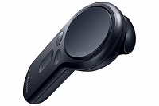

# Gear VR Controller 4 Windows

Use your Gear VR controller as a clicker in your UWP apps over Bluetooth!



## Operating Instructions

### Setup Connection

1.  Attain a Gear VR controller(https://www.samsung.com/us/mobile/virtual-reality/gear-vr/vr-controller-et-yo324bbegus/)
2.  Clone and build the GearVrController4Windows project.
3.  In your own UWP project, add a reference to GearVrController4Windows.dll you've just built.
3.  Create an instance of the GearVrController class:
```csharp
var gearVrController = new GearVrController();
```
3.  Using the Windows.Devices.Enumeration APIs, pair the Gear VR controller and retreive the DeviceInformation object.
One way to do this is by using the DevicePicker class. Here is a code snippet from GearVrController4WindowsSample project demonstrationg how to display the DevicePicker on the form and retrieve the DeviceInformation from the picker:
```csharp
devicePicker = new DevicePicker();

// only show Bluetooth Low Energy devices
devicePicker.Filter.SupportedDeviceSelectors.Add(BluetoothLEDevice.GetDeviceSelectorFromPairingState(true));
devicePicker.Filter.SupportedDeviceSelectors.Add(BluetoothLEDevice.GetDeviceSelectorFromPairingState(false));

// Calculate the position to show the picker (right below the buttons)
GeneralTransform ge = pickDeviceButton.TransformToVisual(null);
Point point = ge.TransformPoint(new Point());
Rect rect = new Rect(point, new Point(point.X + pickDeviceButton.ActualWidth, point.Y + pickDeviceButton.ActualHeight));

// save the device information of the clicked device
DeviceInformation di = await devicePicker.PickSingleDeviceAsync(rect);
``` 

*If you want to create your own device picker, then use the DeviceWatcher class. 
To see how, check out the official Microsoft documentation and sample on this topic here: https://github.com/microsoft/Windows-universal-samples/tree/master/Samples/DeviceEnumerationAndPairing*

**Also, see my other project(https://github.com/ilyabru/Donations-Board) to see how I got the controller to work with an MVVM architectural pattern.**

3. Pass the DeviceInformation argument into the GearVrController Create method (do this in an async method):
```csharp
await gearVrController.Create(di);
```

### Reading Inputs

You would probably want something to happen to the UI when a button is pressed on the controller.
To do so, you can bind the button property to a control 
If you'd would like the button to change something in the back end, then subscribe to the GearVrController PropertyChanged event.

**Binding to a control in XAML:**
```xml
<TextBlock Text="{x:Bind GearVrController.TouchpadButton, Mode=OneWay}" />
<!--GearVrController is a public property in the code-behind. You can also bind to a ViewModel.
In this example, the TextBlock will have a value of "True" when the button is pressed, and "False" when not.-->
```

**Using PropertyChanged in code behind:**
```csharp
public sealed partial class MainPage : Page
{
    public GearVrController GearVrController { get; set; }

    public MainPage()
    {
        GearVrController.PropertyChanged += Gvc_PropertyChanged;
    }

    private void Gvc_PropertyChanged(object sender, PropertyChangedEventArgs e)
    {
        if (GearVrController.TouchpadButton)
        {
            // do something here if big button is pressed
        }

        if (GearVrController.BackButton)
        {
            // do something else if back button is pressed
        }
    }   
}
```

## Notes
* Only two buttons have been implemented so far, the big button and the back button. Gyroscope and touchpad are not used as well.
* Only works with UWP apps running on Windows 10 1809 or above due to APIs used.